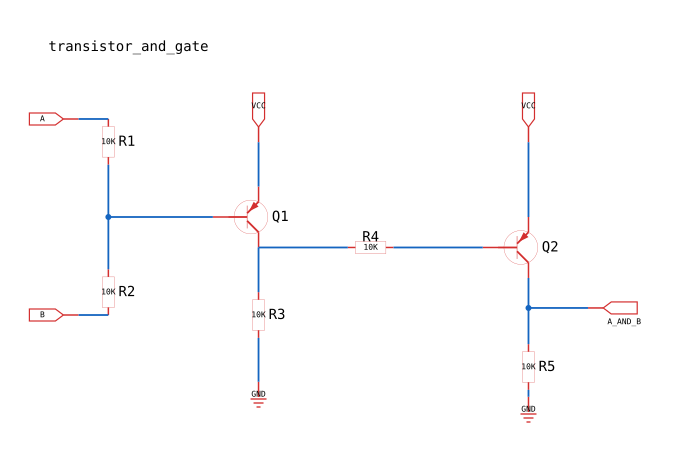

# PySchem


[](https://codecov.io/gh/eirikr-zhong/pyschem)


**Describe schematics in Python. Render them as SVG.**

PySchem is a Python library for building electronic schematics programmatically and exporting them as clean, readable SVG diagrams. No schematic editor required — just Python.

- Free software: MIT license
- Documentation: [docs/development.md](docs/development.md)

---

## Highlights

**Clean SVG output**: Automatic wire routing with obstacle avoidance, junction detection, and fit-to-content viewBox. Renders directly to SVG — no external tools needed.

**KiCad symbol support**: Load parts directly from KiCad `.kicad_sym` libraries. Works with any standard KiCad symbol collection.

**Flexible styling**: Control wire colors, label placement, pin visibility, component rotation, and more via a unified `Style` system.

---

## Quick Example

A two-transistor RTL AND gate:



```python
from pyschem import (
    Part, Junction, NetLabel, GroundNet, Schematic, Style,
    RenderTemplate, WireStyle, connect, configure_default_symbols,
)
from pathlib import Path

symbol_dir = Path(__file__).resolve().parent / "kicad-symbols"
configure_default_symbols(symbol_paths=[str(symbol_dir)], preload=True)

sch = Schematic("and_gate")

q1 = Part("Transistor_BJT:Q_PNP_CBE", ref="Q1")
q2 = Part("Transistor_BJT:Q_PNP_CBE", ref="Q2")
r1 = Part("Device:R", ref="R1", value="10K")
r2 = Part("Device:R", ref="R2", value="10K")
r3 = Part("Device:R", ref="R3", value="10K")
r4 = Part("Device:R", ref="R4", value="10K")
r5 = Part("Device:R", ref="R5", value="10K")

nl_a   = NetLabel("A",       direction="left")
nl_b   = NetLabel("B",       direction="left")
nl_out = NetLabel("A_AND_B", direction="right")
vcc_q1 = NetLabel("VCC",     direction="top")
vcc_q2 = NetLabel("VCC",     direction="top")
gnd_l  = GroundNet()
gnd_r  = GroundNet()

sch.place(r1, x=20, y=25)
sch.place(r2, x=20, y=75)
sch.place(q1, x=65, y=50)
sch.place(q2, x=155, y=50)
# ... (place remaining parts and labels)

# PySchem supports two equivalent connection styles:
#   pin.connect(other)         — concise two-pin form
#   connect(pin_a, pin_b, ...) — multi-pin form, useful for tee junctions
nl_a.label_pin.connect(r1.pin("2"))
nl_b.label_pin.connect(r2.pin("1"))
connect(r1.pin("1"), r2.pin("2"), q1.pin("B"))  # tee junction
q1.pin("C").connect(r4.pin("2"))
r4.pin("1").connect(q2.pin("B"))
q2.pin("C").connect(nl_out.label_pin)

template = RenderTemplate.from_style(Style(wire=WireStyle(color="#1565c0")))
sch.export_svg("out/and_gate.svg", template=template)
```

See [`examples/transistor_and_gate_svg.py`](examples/transistor_and_gate_svg.py) for the full working example.

---

## Installation

```bash
pip install pyschem
```

Or install from source:

```bash
git clone https://github.com/eirikr-zhong/pyschem.git
cd pyschem
pip install -e .
```

---

## Getting Started

1. **Run the example**: `cd examples && python3 transistor_and_gate_svg.py` — output appears in `examples/out/`
2. **Read the dev guide**: [`docs/development.md`](docs/development.md) covers project structure, style system, and conventions

---

## Features

| Feature | Status |
|---|---|
| KiCad symbol library support | ✅ |
| Automatic wire routing | ✅ |
| Obstacle avoidance | ✅ |
| SVG export with fit-to-content | ✅ |
| Custom viewBox override | ✅ |
| Debug overlay mode | ✅ |
| DOT graph export | ✅ |
| ERC (Electrical Rules Check) | 🚧 planned |
